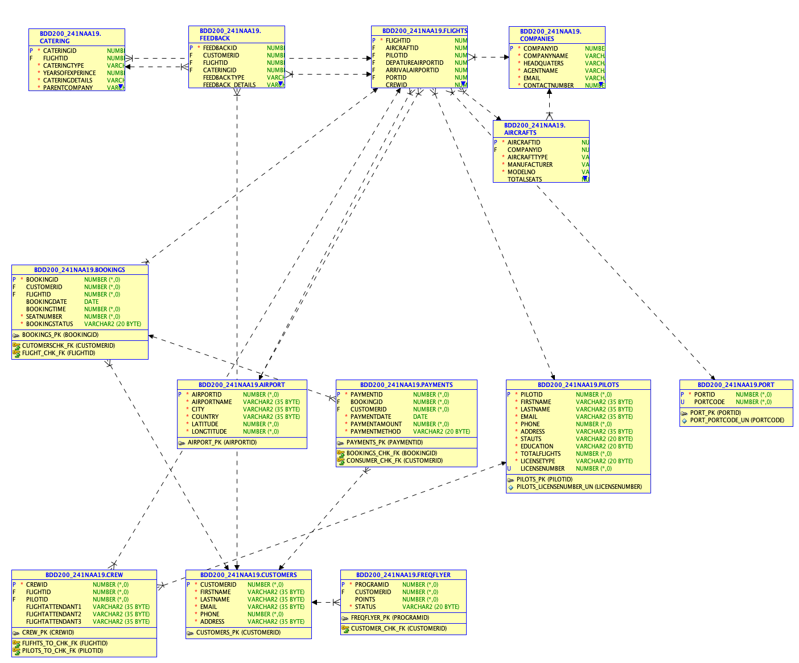

# ✈️ Flight Admin Database System

A relational database system that simulates an **Airline Reservation App**.  
This project models the core operations of an airline system, including **bookings, flights, catering, payments, customer feedback, aircrafts, pilots, airports, and frequent flyer programs**.

The project demonstrates skills in **database design, normalization, SQL schema creation, data loading, and advanced SQL queries**.

---

##  Repository Structure
```

flight-admin-db/
├─ README.md
├─ schema/
│  ├─ BDD2001.sql               # full database schema
│  ├─ Project2.sql              # additional schema definitions
│  ├─ Group3\_creationscript.sql # table creation script
│  └─ Group3\_datascript.sql     # insert sample data
├─ docs/
│  ├─ Group3\_ERD.png            # entity-relationship diagram
│  ├─ Group3\_datadictionary.md  # data dictionary
│  └─ Group03\_ADVSQL-reports.md # advanced SQL queries & reports
└─ data/
└─ sample\_data.sql           # test/sample dataset

````

---

##  Objectives

- Design and implement a **normalized relational schema** for an airline reservation system.  
- Provide **sample data** for flights, customers, airports, and pilots.  
- Create **ERD diagrams** and **data dictionaries** for documentation.  
- Write **advanced SQL queries** for real-world reports and analysis.  

---

##  Database Design

### Main Entities
- **Customers** – passengers and frequent flyers  
- **Flights** – scheduled flight operations  
- **Aircrafts** – aircraft details and seat capacity  
- **Airports** – hubs and destinations  
- **Bookings** – reservations linked to customers and flights  
- **Payments** – transactions for bookings  
- **Catering** – onboard services and providers  
- **Feedback** – customer service and flight ratings  
- **Pilots & Crew** – airline staff and assignments  
- **Companies** – operating carriers  

### ERD
  
*Entity-Relationship Diagram of the Flight Admin system.*

---

##  Documentation

- **Data Dictionary** → describes schema attributes, datatypes, constraints, and validation rules.  
- **Sample Data** → realistic inserts for flights, bookings, payments, and customers.  
- **Advanced SQL Reports** → joins, nested subqueries, aggregations, set operations.

---

##  How to Run

### 1. Create the schema
```sql
-- Run in your SQL client (Oracle, MySQL, or PostgreSQL depending on setup)
@schema/BDD2001.sql
@schema/Project2.sql
````

### 2. Load sample data

```sql
@schema/Group3_datascript.sql
```

### 3. Execute advanced queries

```sql
@docs/Group03_ADVSQL-reports.sql
```

---

##  Example Reports

Some of the advanced SQL queries included:

* Find the **most recent and earliest bookings**.
* Calculate **average, highest, and lowest booking payments**.
* Count catering services by **catering type**.
* Show flights or services with **negative feedback**.
* List customers who **paid above average**.
* Display **most experienced pilots** and average flight hours.
* Find countries with **multiple airports**.
* Identify customers **not enrolled in frequent flyer programs**.

---

##  Tech Stack

* **SQL (DDL + DML)** → schema creation and data manipulation
* **Oracle SQL Developer / MySQL Workbench** → database execution environment
* **ERD Tools** → schema visualization
* **Markdown & Docs** → documentation and reporting

---

##  Key Learnings

* Database **normalization and schema design**
* Use of **primary/foreign keys, check constraints, and validation rules**
* Writing **complex SQL queries** with subqueries, joins, unions, and group by
* Translating a **real-world domain (airline system)** into a working relational database

---

##  Contributors

* Harleen Kaur
* Sama Borhani
* Urman Nagari

---

##  License

This project is shared for educational purposes under the MIT License.

