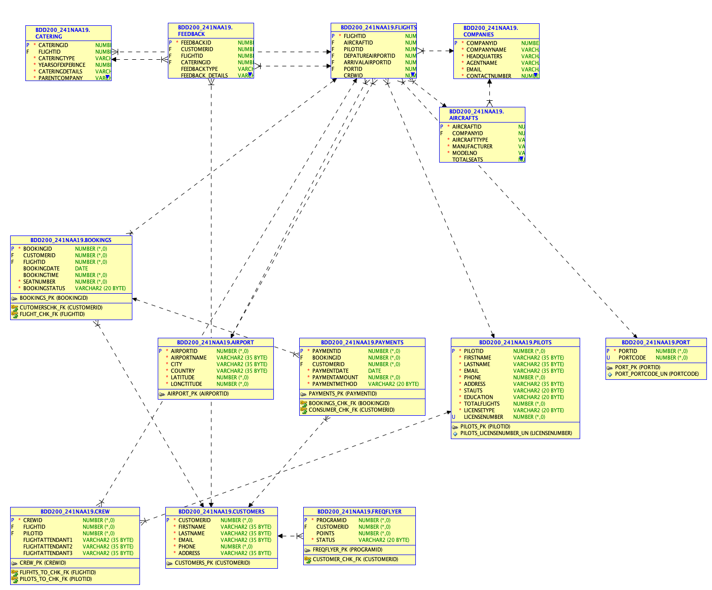

# ✈️ Flight Admin Database System

A relational database project simulating an **Airline Reservation App**, designed to handle bookings, payments, catering services, and customer feedback.  
This repository demonstrates end-to-end **database design, schema creation, sample data insertion, ERD modeling, and SQL reporting**.

---

##  Repository Structure

```

flight-admin-db/
├─ README.md                  
├─ LICENSE                    
├─ .gitignore                 
├─ docs/                      
│  ├─ ERD.png                 
│  ├─ data\_dictionary.pdf     
│  └─ ADVSQL-reports.pdf      
└─ schema/                    
├─ creationscript\_sample.md
├─ datascript\_sample.md
├─ Flight\_Admin\_1.sql
└─ Flight\_Admin\_2.sql

````

---

##  Objectives

- Design a normalized relational schema for an airline system.  
- Implement **core entities**: customers, flights, bookings, catering, payments, and feedback.  
- Populate the schema with **sample data** for demonstration.  
- Document the schema using an **ERD** and **data dictionary**.  
- Run **advanced SQL queries** for reporting and insights.  

---

##  Database Design

### Key Entities
- **BOOKINGS** → reservations linked to flights and customers.  
- **CATERING** → meal, beverage, and snack services per flight.  
- **PAYMENTS** → transaction records tied to bookings.  
- **FEEDBACK** → customer ratings and comments.  

### ERD
  
*Entity-Relationship Diagram of the Flight Admin Database.*

---

##  Documentation

- [Data Dictionary (PDF)](docs/data_dictionary.pdf)  
  Defines all attributes, datatypes, and constraints.  
- [Advanced SQL Reports (PDF)](docs/ADVSQL-reports.pdf)  
  Includes analytical queries such as highest payments, flight feedback summaries, and catering service breakdowns.  

---

##  How to Run

### 1. Create the schema
Run the SQL scripts in your database environment (Oracle, MySQL, or PostgreSQL with minor adjustments):

```sql
@schema/Flight_Admin_1.sql
@schema/Flight_Admin_2.sql
````

### 2. Insert sample data

Use the data scripts (Markdown docs show examples):

```sql
@schema/datascript_sample.sql   -- if you export to .sql
```

### 3. Run reports

Use queries from the advanced SQL reports file:

```sql
@docs/ADVSQL-reports.sql
```

---

##  Example Reports

Some of the included queries produce:

* Bookings with **highest, lowest, and average payments**.
* Flights with **negative vs. positive feedback**.
* Top catering services by **type and provider**.
* Customers **without frequent flyer programs**.
* Pilots ranked by **experience level**.

---

##  Tech Stack

* **SQL (DDL & DML)** → schema creation and data manipulation.
* **ERD Modeling Tools** → for database visualization.
* **Oracle / MySQL** → tested in SQL Developer; portable with adjustments.
* **Markdown & PDF Docs** → documentation and reporting.

---

##  Key Learnings

* Database normalization and schema design.
* Proper use of **primary keys, foreign keys, and check constraints**.
* Writing **complex SQL queries** (joins, subqueries, aggregates, constraints).
* Translating a **real-world business domain** into a structured relational model.

---

##  License

This project is licensed under the terms of the [MIT License](LICENSE).


